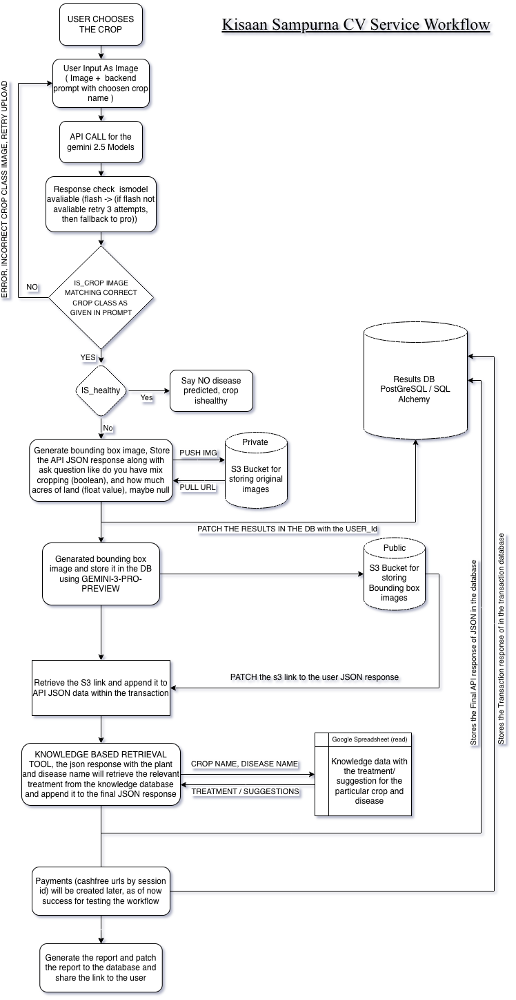

# Kisaan Sampurna CV Service

A FastAPI-based computer vision service for crop disease detection and analysis, powered by Google Gemini AI. This service analyzes crop images, detects diseases, provides treatment recommendations, and generates detailed health reports in multiple languages.



## 🌾 Features

### Core Functionality
- **AI-Powered Disease Detection**: Uses Google Gemini 2.5 Flash for rapid image analysis
- **Bounding Box Generation**: Gemini 3.0 Pro Preview for precise disease localization
- **Multi-Language Support**: English and Kannada (en/kn)
- **Knowledge Base Integration**: 469+ crop disease treatment records
- **Image Processing**: Automatic bbox overlay and visualization
- **S3 Storage**: Secure public/private bucket management
- **Database Persistence**: PostgreSQL with dedicated schema isolation

### Supported Crops
- Rice (ಭತ್ತ)
- Wheat (ಗೋಧಿ)
- Maize (ಮೆಕ್ಕೆ ಜೋಳ)
- Cotton (ಹತ್ತಿ)
- Tomato (ಟೊಮೇಟೊ)
- Potato (ಆಲೂಗಡ್ಡೆ)
- And many more...

## 🏗️ Architecture

### Tech Stack
- **Framework**: FastAPI (Python 3.12)
- **Database**: PostgreSQL 17.4 (AWS RDS)
- **AI/ML**: Google Gemini AI (2.5 Flash, 3.0 Pro Preview)
- **Storage**: AWS S3 (public/private buckets)
- **ORM**: SQLAlchemy (async)
- **Containerization**: Docker & Docker Compose
- **Migrations**: Alembic + Custom SQL

### Project Structure
```
kisaan_cv_services/
├── app/
│   ├── models/          # Database models (SQLAlchemy)
│   ├── schemas/         # Pydantic schemas for validation
│   ├── routers/         # API endpoints
│   │   └── v1/
│   │       └── scan.py  # Main crop scanning endpoint
│   ├── services/        # Business logic
│   │   ├── gemini.py    # AI analysis service
│   │   ├── s3.py        # S3 storage service
│   │   ├── image.py     # Image processing
│   │   └── knowledge.py # Knowledge base lookup
│   ├── config.py        # Configuration management
│   ├── database.py      # Database connection
│   └── app.py           # FastAPI application
├── migrations/          # Database migrations
│   ├── versions/        # Alembic migration files
│   └── 001_initial_schema.sql
├── knowledge_based_folder/  # Treatment knowledge base
├── SharedBackend/       # Shared backend utilities
├── static/              # Static files (UI)
├── Dockerfile
├── docker-compose.yml
└── requirements.txt
```

## 🚀 Quick Start

### Prerequisites
- Docker & Docker Compose
- Python 3.12+ (for local development)
- PostgreSQL 17+ (or use RDS)
- AWS Account (for S3)
- Google Cloud Account (for Gemini API)

### Environment Setup

1. **Clone the repository**
```bash
git clone https://github.com/silo-prod/Kissan-Sampurna-CV-service.git
cd Kissan-Sampurna-CV-service
```

2. **Create `.env` file**
```bash
cp .env.example .env
```

3. **Configure environment variables**
```env
# Database
POSTGRES_SERVER=your-rds-endpoint.rds.amazonaws.com
POSTGRES_USER=kissan_cv_dev
POSTGRES_PASSWORD=your_password
POSTGRES_DB=kissansampurna_dev
POSTGRES_PORT=5432
DB_SCHEMA=kissan_cv

# Gemini AI
GEMINI_API_KEY=your_gemini_api_key
GEMINI_MODEL_FLASH=gemini-2.5-flash
GEMINI_MODEL_PRO=gemini-2.5-pro
GEMINI_MODEL_BBOX=gemini-3-pro-preview

# AWS S3
AWS_ACCESS_KEY_ID=your_access_key
AWS_SECRET_ACCESS_KEY=your_secret_key
AWS_REGION=ap-south-1
S3_BUCKET_PRIVATE=your-private-bucket
S3_BUCKET_PUBLIC=your-public-bucket

# App
SECRET_KEY=your_secret_key_here
ENV_MODE=dev
```

### Database Setup

#### Using Dedicated Schema (Recommended)

This service uses the `kissan_cv` schema for isolation:

```sql
-- Run with admin privileges
CREATE SCHEMA IF NOT EXISTS kissan_cv;
GRANT USAGE, CREATE ON SCHEMA kissan_cv TO kissan_cv_dev;
```

#### Run Migration

**Option 1: Using Docker**
```bash
docker-compose run --rm web python migrations/001_initial_schema.sql
```

**Option 2: Using psql**
```bash
psql -h your-host -U admin_user -d your_db -f migrations/001_initial_schema.sql
```

### Running the Application

**Docker (Recommended)**
```bash
# Build and start
docker-compose up --build

# Run in background
docker-compose up -d

# Stop services
docker-compose down
```

**Local Development**
```bash
# Create virtual environment
python -m venv venv
source venv/bin/activate  # On Windows: venv\Scripts\activate

# Install dependencies
pip install -r requirements.txt
pip install -r SharedBackend/requirements.txt

# Run server
uvicorn app.app:app --host 0.0.0.0 --port 8000 --reload
```

## 📡 API Endpoints

### Health Checks
- `GET /health` - Application health
- `GET /health/db` - Database connectivity

### Crop Analysis
- `GET /api/v1/crops?language=en` - Get supported crops list
- `POST /api/v1/crop_scan` - Analyze crop image

### Documentation
- `GET /docs` - Interactive Swagger UI
- `GET /api/v1/openapi.json` - OpenAPI specification

## 🔬 API Usage

### Crop Scan Request

```bash
curl -X POST "http://localhost:8000/api/v1/crop_scan" \
  -H "Content-Type: multipart/form-data" \
  -F "file=@crop_image.jpg" \
  -F "user_id=user_12345" \
  -F "crop_name=Tomato" \
  -F "language=en" \
  -F "is_mixed_cropping=false" \
  -F "acres_of_land=2.5"
```

### Response Format

```json
{
  "id": "crop_analysis_report_uuid-xxx",
  "user_id": "user_12345",
  "created_at": "2025-12-27T10:30:00Z",
  "original_image_url": "https://s3.../original/image.jpg",
  "bbox_image_url": "https://s3.../processed/image.jpg",
  "report_url": null,
  "disease_detected": "Late Blight",
  "user_input_crop": "Tomato",
  "language": "en",
  "kb_treatment": "Apply Mancozeb 75% WP @ 2g/liter...",
  "analysis_raw": {
    "plant_info": {
      "common_name": "Tomato",
      "scientific_name": "Solanum lycopersicum"
    },
    "disease_info": {
      "common_name": "Late Blight",
      "pathogen_type": "Fungal",
      "severity": "High"
    }
  }
}
```

## 🔄 Workflow

1. **Image Upload**: User uploads crop image with metadata
2. **Validation**: System validates crop against AI analysis
3. **AI Analysis**: Gemini 2.5 Flash analyzes the image
4. **Disease Detection**: If disease found, proceed; else return "Healthy"
5. **Bounding Box**: Gemini 3.0 Pro generates disease bounding boxes
6. **Image Processing**: Draw boxes on image, save locally and to S3
7. **Knowledge Lookup**: Fetch treatment from knowledge base
8. **Database Storage**: Save analysis to `kissan_cv.crop_analysis_report`
9. **Response**: Return complete analysis with URLs and treatment

## 🗄️ Database Schema

### Table: `kissan_cv.crop_analysis_report`

```sql
CREATE TABLE kissan_cv.crop_analysis_report (
    uid VARCHAR PRIMARY KEY,
    created_at TIMESTAMP WITH TIME ZONE DEFAULT NOW(),
    updated_at TIMESTAMP WITH TIME ZONE,
    deleted_at TIMESTAMP WITH TIME ZONE,
    
    -- User & Input
    user_id VARCHAR(50) NOT NULL,
    user_input_crop VARCHAR(255),
    language VARCHAR(10) DEFAULT 'en',
    is_mixed_cropping BOOLEAN,
    acres_of_land VARCHAR(50),
    
    -- Detection Results
    detected_crop VARCHAR(255),
    detected_disease VARCHAR(255),
    pathogen_type VARCHAR(100),
    severity TEXT,
    treatment TEXT,
    
    -- Data & URLs
    analysis_raw JSONB,
    original_image_url TEXT,
    bbox_image_url TEXT,
    report_url TEXT
);
```

**Indexes:**
- `idx_crop_analysis_report_user_id` on `user_id`
- `idx_crop_analysis_report_created_at` on `created_at`

## 🛠️ Development

### Adding New Crops

1. Update knowledge base CSV:
   - `knowledge_based_folder/Knowledge Based Data For Agent - Crop_knowledge_database.csv` (English)
   - `knowledge_based_folder/Knowledge data in kannada - Kannada_Translated_Crop_Knowledge_Database.csv` (Kannada)

2. Service will auto-reload the knowledge base on startup

### Testing

```bash
# Database connection test
docker-compose run --rm web python -c "from app.database import engine; import asyncio; asyncio.run(engine.connect())"

# Knowledge base test
curl http://localhost:8000/api/v1/crops?language=en
```

## 📦 Deployment

### Docker Build

```bash
# Build image
docker build -t kisaan-cv-service:latest .

# Tag for registry
docker tag kisaan-cv-service:latest your-registry/kisaan-cv-service:v1.0

# Push to registry
docker push your-registry/kisaan-cv-service:v1.0
```

### Environment-Specific Configuration

- **Development**: `ENV_MODE=dev` - Verbose logging, hot reload
- **Staging**: `ENV_MODE=stage` - Moderate logging
- **Production**: `ENV_MODE=prod` - Minimal logging, optimized

## 🔒 Security

- **Environment Variables**: Never commit `.env` to git
- **API Keys**: Rotate regularly, use IAM roles when possible
- **Database**: Use SSL connections (`ssl=require`)
- **S3**: Separate public/private buckets
- **Schema Isolation**: Dedicated `kissan_cv` schema per service

## 🐛 Troubleshooting

### Database Connection Issues

**Problem**: `permission denied for schema public`
**Solution**: Use dedicated schema `kissan_cv` instead of `public`

```sql
GRANT USAGE, CREATE ON SCHEMA kissan_cv TO kissan_cv_dev;
```

### Image Processing Errors

**Problem**: Bounding box generation fails
**Solution**: Check Gemini API quota and model availability

### Docker Build Issues

**Problem**: `operation not permitted` error
**Solution**: Remove macOS metadata files

```bash
find . -name "._*" -delete
```

## 📝 License

Proprietary - SiloFortune Production

## 👥 Contributors

- Development Team @ Silofortune Production

## 📞 Support

For issues and questions:
- GitHub Issues: [Create Issue](https://github.com/silo-prod/Kissan-Sampurna-CV-service/issues)
- Email: kishan@silofortune.com

---

**Version**: 1.0.0  
**Last Updated**: December 27, 2025  
**Status**: Production Ready ✅
